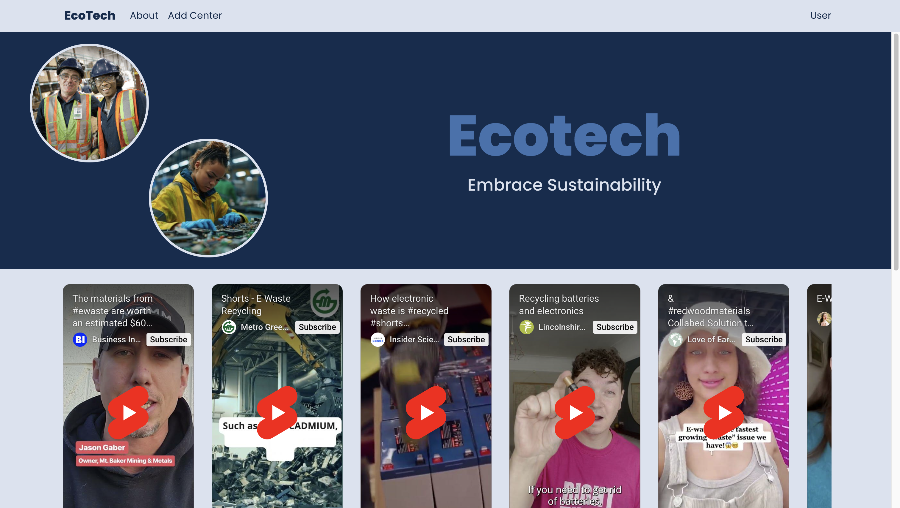

# EcoTech 🌱 - Now Live!  

EcoTech is an open-source platform dedicated to promoting responsible electronic waste (e-waste) recycling. Originally developed during a United Nations NGO Hackathon, the project has since been rebuilt from the ground up, with enhanced functionality and a stronger foundation.  

🚀 **Now Live!** The platform is officially deployed—making it easier than ever to locate certified recycling centers and learn about responsible e-waste disposal.  

🔗 **[Visit EcoTech Here](https://ecotech-hm9z.onrender.com)**  

💡 **New recycling centers will be added periodically by admin, and user-submitted centers will be added upon approval!**  

---

## 🌟 Features  

✅   **Certified Recycling Center Locator** – Find verified e-waste recycling centers near you.  
📚   **Educational Resources** – Learn about sustainable e-waste management.  
🏢   **Business & Individual Tools** – Manage electronic waste disposal efficiently.  
🔄   **Sustainable Disposal Solutions** – Encourage environmentally friendly recycling practices.  

---

## 📸 Screenshots  

  

---

## 🛠️ Tech Stack  

### Frontend  
- ⚛ **React** – Component-based UI development  
- 🎨 **React-Bootstrap** – Responsive design  
- 🚏 **React Router** – Client-side navigation  
- 🎨 **Custom CSS** – Styling & UI improvements  

### Backend  
- ☕ **Java + Spring Boot** – Scalable API development  
- 📍 **HERE Maps API** – Geolocation services for recycling centers  

---

## 🚀 Installation & Setup

Frontend Setup Instructions

1. Clone the repository:
   ```bash
   git clone https://github.com/xjohnsondev/EcoTech.git

2.	Navigate to the project directory:
    ```bash
    cd un-frontend

3. Install the dependencies:
    ```bash
    npm install

4. Run the development server:
    ```bash
    npm start

Backend Setup Instructions

1.	Navigate to the project directory:
    ```bash
    cd ewaste_backend

2. 	Setup environmantal variables:
    ```bash
    •   Create an .env file in the backend directory.
	•	Add necessary configurations such as database credentials, API keys, and authentication secrets.

3. Install the dependencies:
    ```bash
    ./mvnw clean install

4. Run the backend server:
    ```bash
    ./mvnw spring-boot:run

5. Verify the server is running:
    ```bash
    The API should be available at http://localhost:8080.

💡 Alternatively - Launch IntelliJ, navigate to **src/EwasteBackendApplication**, Press Run.

# 🌍 Contributing to EcoTech  

EcoTech is **open-source** and welcomes contributions from developers passionate about sustainability and technology!  

## 🚀 Ways to Contribute  

- 🛠 **Feature Development** – Build new tools to improve e-waste management.  
- 🐞 **Bug Fixes** – Help identify and fix issues.  
- 🎨 **UI/UX Enhancements** – Improve the user experience.  
- 🌎 **Localization** – Translate the platform into other languages.  

## 🏁 Getting Started  

1. **Fork the repository**  
   - Click the **Fork** button at the top right of this repository’s GitHub page.  
   - This creates a copy of the EcoTech repository under your GitHub account.  

2. **Create a new branch**  
   - Navigate to your forked repository on GitHub.  
   - Clone it to your local machine:  
     ```bash
     git clone https://github.com/your-username/EcoTech.git
     cd EcoTech
     ```
   - Create a new branch for your feature or fix:  
     ```bash
     git checkout -b feature-name
     ```
     Example:  
     ```bash
     git checkout -b add-dark-mode
     ```

3. **Make your changes**  
   - Implement your feature, bug fix, or enhancement.  
   - Stage and commit your changes:  
     ```bash
     git add .
     git commit -m "Added dark mode feature"
     ```
   - Push your branch to your forked repository:  
     ```bash
     git push origin feature-name
     ```

4. **Submit a pull request (PR)**  
   - Go to the original EcoTech repository on GitHub.  
   - Click **New Pull Request** and select your branch.  
   - Add a clear title and description of your changes.  
   - Click **Create Pull Request** and wait for review. 

We welcome all contributions that align with **EcoTech’s mission** of promoting responsible e-waste recycling!  

♻️ **Let’s build a greener future together.** 🌱  


## 📜 License

[MIT](https://choosealicense.com/licenses/mit/)

